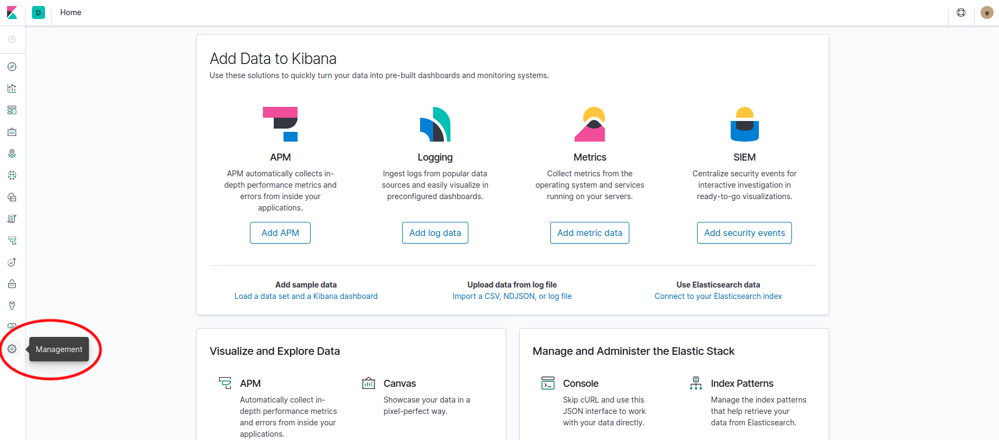
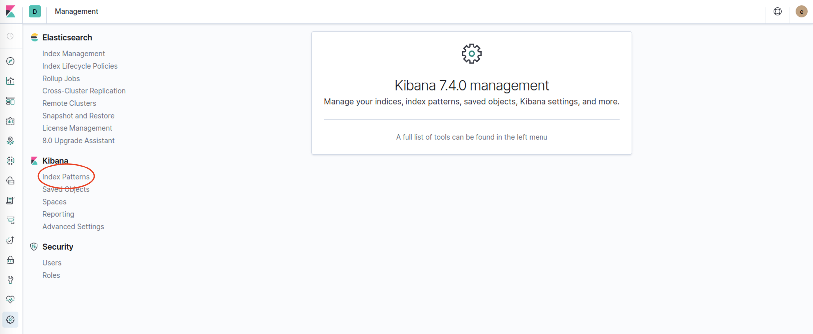
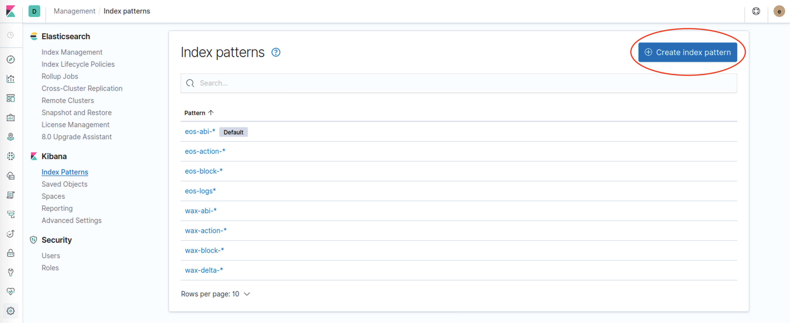
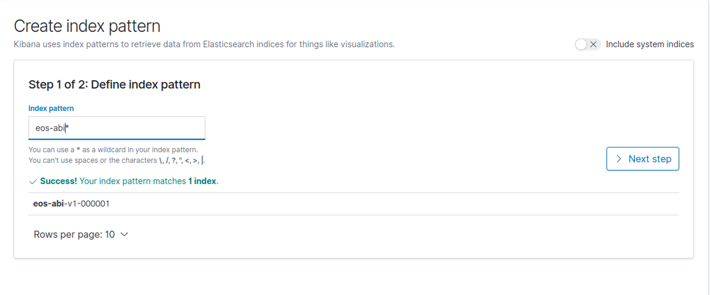
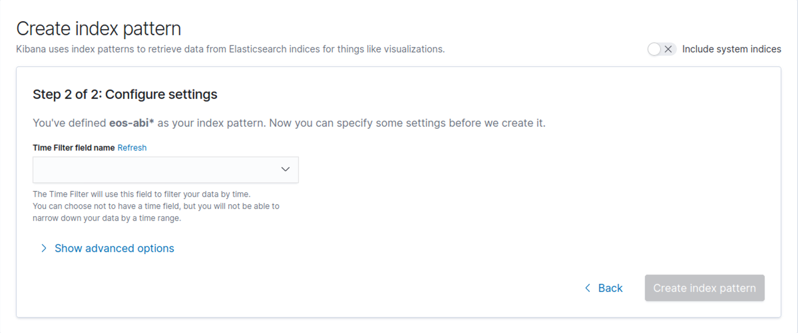
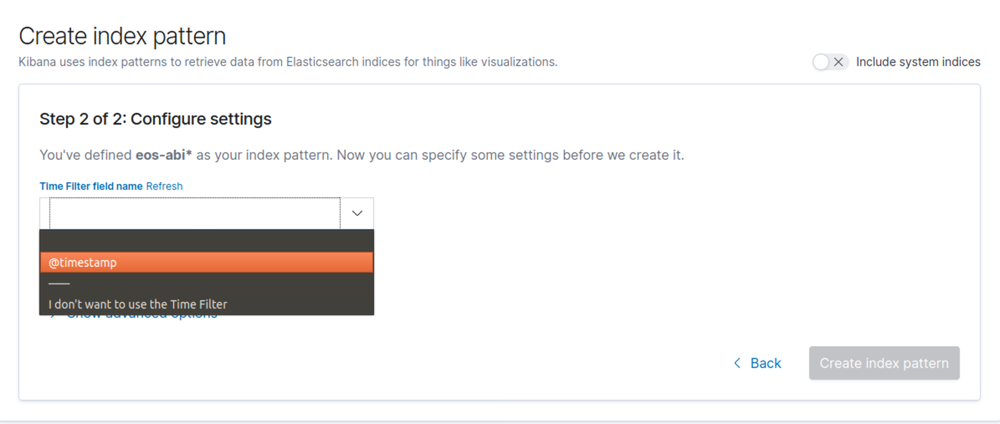

The purpose here is to guide you through some basic steps using and configuring the Kibana. 
For more detailed information, please, refer to the [official documentation](https://www.elastic.co/guide/en/kibana/current/index.html).

## Running Kibana with `systemd`
To configure Kibana to start automatically when the system boots up, run the following commands:
```
sudo /bin/systemctl daemon-reload
sudo /bin/systemctl enable kibana.service
```
Kibana can be started and stopped as follows:
```
sudo systemctl start kibana.service
sudo systemctl stop kibana.service
```
These commands provide no feedback as to whether Kibana was started successfully or not. 
Log information can be accessed via `journalctl -u kibana.service.`

## Opening Kibana

Open [http://localhost:5601](http://localhost:5601) and check if you can access Kibana.

If Kibana asks for credentials, the default user and password is:

```
user: elastic
password: changeme
```
    
If you can't access, check your credentials on your config file.

## Creating index pattern

1. To create a new index pattern, go to `Management`

    [](img/kibana1.png)

2. Click on `Index Patterns` at the left menu
 
    [](img/kibana2.png)

3. Click on `Create index pattern`
 
    [](img/kibana3.png)
    
4. Enter desired index pattern and click on `> Next step`
 
    [](img/kibana4.png)
 
    !!! tip
         Index Pattern List:
         `eos-abi-*` `eos-action-*` `eos-block-*` `eos-logs-*` `eos-delta-*`     
         Where `eos` is the name of the chain.

5. Select a time filter, if there are any, and click on `Create index pattern`
 
    [](img/kibana5.png)
    
    [](img/kibana6.png)
 
## Index Management

## Discover